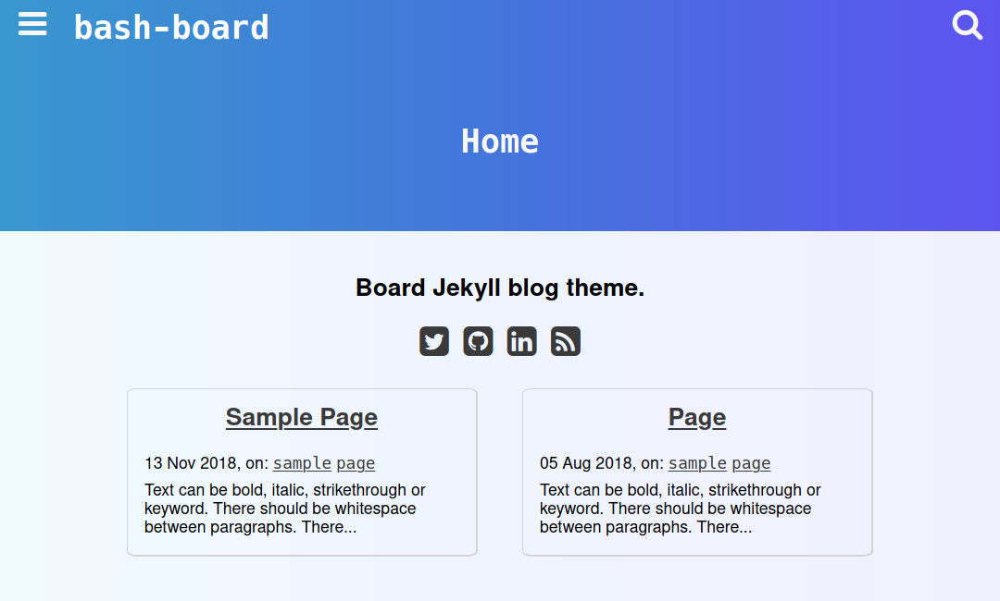

# [bash-board](https://vllur.github.io/bash-board/)  

A Jekyll blog theme, with side nav menu, search page and many other features.

A live demo is available [here](https://vllur.github.io/bash-board/).

## Features:
- no dependencies
- can be hosted easily on [Github Pages](https://pages.github.com/)
- modern
- responsive
- simplistic
- really fast (100 points on PageSpeed Insights!)

## How to:
- do easy deploy:
  1. Fork this repo
  1. Change `baseurl` in `_config.yml` to `/`
  1. Change its name to [nickname].github.io
  1. Visit [nickname].github.io
- customize your posts:
  - They can be found in `_posts` directory - you can use existing posts as reference to creating your own
- customize colours and gradients:
  - All of the colours are in `_sass/variables.scss` file. Editing them will edit colours site-wide.

## Licensing:
### Project
This project is licensed under the MIT license.

### Font Awesome
   Copyright (C) 2016 by Dave Gandy, SIL license

   [fortawesome.com](http://fortawesome.github.com/Font-Awesome/)
